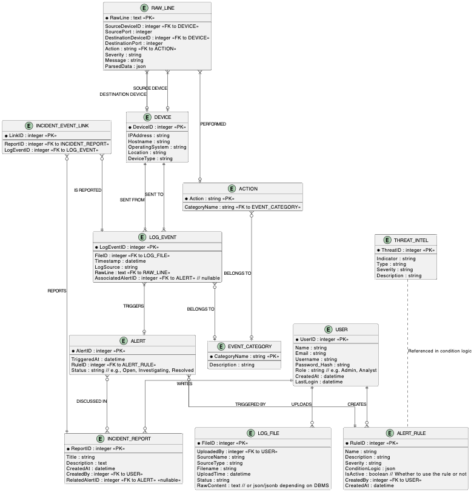

# Mini-SIEM: Digital Forensics Log Analyzer
A mini security information and event management system for my Spring 2025 Database Fundamentals Course.

## Name
Matthew Birnhak

## Purpose & Summary
This project aims to help cybersecurity analysts collect, store, analyze, and visualize log data from various sources for forensic investigations and threat detection. It will function as a lightweight Security Information and Event Management (SIEM) tool, providing log aggregation, centralized storage, and interactive dashboards for exploring system events.

The system will collect logs from sources such as web servers, firewalls, system event logs, and authentication records. Logs will be parsed, categorized, and stored in a structured database to enable efficient searching, filtering, and visualization. Users will be able to view real-time log streams, apply filters to sort logs by source, severity, or time range, and generate reports on specific security events.

## Proposed Entities  

The proposed system will include several key entities to manage log collection, storage, and visualization effectively:  

1. **Users**:
- Represents individuals who access the system, including cybersecurity analysts and administrators. Users can upload logs, apply filters, and configure alert rules.  

2. **Log Files**:
- Represents raw log data collected from different sources, such as web servers, firewalls, and system event logs. Each log file is parsed and stored for further analysis

3. **Log Events**:
- Represents individual log entries extracted from log files. Each event includes details such as timestamp, source, severity level, message content, and associated metadata.

4. **Event Categories**:
- Defines classifications for log events, such as authentication attempts, network activity, or security alerts. Categorizing events helps users filter and analyze logs more efficiently.  

5. **Alerts**:
- Represents predefined rules that trigger notifications when certain conditions are met (e.g., multiple failed login attempts from the same IP). Alerts help detect potential security incidents in real time.  

6. **Devices**:
- Each log entry will be associated with a source and destination device
- Will still information related to such a device like ip_addr, hostname, OS, etc.

7. **Incident Reports**:
- Analysts can generate incident reports related to specific log events and alerts.

8. **Alert Rules**:
- Represents predefined conditions or thresholds that trigger alerts in the system. These rules help identify suspicious or malicious activities, such as repeated failed logins, unusual network traffic, or specific actions performed by unauthorized users.
- Alert rules are essential for automating detection of potential security incidents and minimizing manual monitoring efforts.

9. **Threat Intelligence**:
- Represents known threat data from external sources, such as IP addresses, domains, file hashes, and URLs, that are flagged as indicators of compromise (IoCs) or known bad actors.
- These entries help analysts correlate suspicious activities and identify potential threats based on recognized patterns.
- May be preloaded from external sources, but can also be uploaded/pulled from APIs to contain real time data.

These entities will form the foundation of the system, ensuring structured storage, efficient querying, and effective log analysis.

## Technology Stack
- Frontend: React.js
- Backeend: Java with Springboot
- Database: PostgreSQL with extension for time-series data (TimescaleDB)

## User CRUD Operations
### Create
Users can upload logs or files containing logs.
### Read
Search and filter logs, view alert details, view different charts & diagrams of data.
### Update
Analysts review alerts, mark incidents as resolved. Can manually categorize logs.
### Delete
Remove outdated logs, clear false positives

## List of All Final Tables:
- USER
- LOG_FILE
- LOG_EVENT
- RAW_LINE
- ACTION
- EVENT_CATEGORY
- ALERT
- DEVICE
- INCIDENT_REPORT
- INCIDENT_EVENT_LINK
- ALERT_RULE
- THREAT_INTEL

## ER Diagram

# Database Schema (Updated for Normalized Tables)

## USER

| Column          | Description                                              |
|-----------------|----------------------------------------------------------|
| UserID (PK)     | Unique user identifier                                   |
| Name            | User's full name                                         |
| Email (UNIQUE)  | User's email address (unique)                            |
| Username (UNIQUE) | Unique username for login                               |
| Password_Hash    | Hashed password for secure authentication               |
| Role            | User's role in the system (e.g., Admin, Analyst)         |
| CreatedAt       | Timestamp of account creation                            |
| LastLogin       | Timestamp of user's last login                           |

---

## LOG_FILE

| Column          | Description                                              |
|-----------------|----------------------------------------------------------|
| FileID (PK)     | Unique identifier for the uploaded log file              |
| UploadedBy (FK) | Reference to the user who uploaded the log file          |
| SourceName      | Name of the system or application that generated the log |
| SourceType      | Type/category of the log source (e.g., Firewall, Server) |
| Filename        | Name of the uploaded log file                            |
| UploadTime      | Timestamp indicating when the file was uploaded         |
| Status          | Current processing status (e.g., Pending, Complete)     |
| RawContent      | Raw text or data content of the uploaded log file        |

---

## LOG_EVENT

| Column             | Description                                              |
|--------------------|----------------------------------------------------------|
| LogEventID (PK)     | Unique identifier for each individual log event          |
| FileID (FK)         | Reference to the log file that contains this event       |
| Timestamp           | Date and time when the log event occurred                |
| LogSource           | Identifier or name of the system that generated the event|
| RawLine (FK)        | Reference to the raw log line                             |
| AssociatedAlertID (FK) | Reference to an alert generated from this event, if any |

---

## RAW_LINE

| Column              | Description                                              |
|---------------------|----------------------------------------------------------|
| RawLine (PK)         | Original unparsed line from the log file                 |
| SourceDeviceID (FK)  | Reference to the source device involved in the event     |
| SourcePort           | Network port on the source device                        |
| DestinationDeviceID (FK) | Reference to the destination device involved in the event |
| DestinationPort      | Network port on the destination device                   |
| Action (FK)          | Reference to the action that occurred                    |
| Severity             | Severity level of the event (e.g., Low, Medium, High)    |
| Message              | Human-readable description or summary of the event      |
| ParsedData           | Structured data extracted from the raw log line          |

---

## ACTION

| Column         | Description                                          |
|----------------|------------------------------------------------------|
| Action (PK)    | Name of the action performed (e.g., login, file access)|
| CategoryName (FK) | Classification of the event type                |

---

## EVENT_CATEGORY

| Column            | Description                                        |
|-------------------|----------------------------------------------------|
| CategoryName (PK) | Name of the event category (e.g., Authentication)  |
| Description       | Description of the event category                  |

---

## ALERT

| Column              | Description                                              |
|---------------------|----------------------------------------------------------|
| AlertID (PK)         | Unique identifier for the alert                         |
| TriggeredAt          | Timestamp when the alert was generated                  |
| RuleID (FK)          | Reference to the rule that triggered the alert           |
| Status               | Current state of the alert (e.g., Open, Investigating, Resolved) |

---

## DEVICE

| Column              | Description                                              |
|---------------------|----------------------------------------------------------|
| DeviceID (PK)        | Unique identifier for the device                        |
| IPAddress            | IP address of the device                                |
| Hostname             | Name of the device on the network                       |
| OperatingSystem      | Operating system running on the device                  |
| Location             | Physical or logical location of the device (e.g., Data Center A) |
| DeviceType           | Classification of the device (e.g., Workstation, Server) |

---

## INCIDENT_REPORT

| Column              | Description                                              |
|---------------------|----------------------------------------------------------|
| ReportID (PK)        | Unique identifier for the incident report               |
| Title                | Title of the incident                                   |
| Description          | Detailed description of the incident and its impact     |
| CreatedAt            | Timestamp when the report was created                   |
| CreatedBy (FK)       | Reference to the user who created the report             |
| RelatedAlertID (FK)  | Reference to the primary alert associated with this incident |

---

## INCIDENT_EVENT_LINK

| Column              | Description                                              |
|---------------------|----------------------------------------------------------|
| ReportID (PK, FK)        | Reference to the associated incident report             |
| LogEventID (PK, FK)      | Reference to the related log event                       |

---

## ALERT_RULE

| Column              | Description                                              |
|---------------------|----------------------------------------------------------|
| RuleID (PK)          | Unique identifier for the detection rule                |
| Name                 | Name of the alert rule                                   |
| Description          | Explanation of what the rule is designed to detect      |
| Severity             | Default severity level assigned to triggered alerts     |
| ConditionLogic       | Logic or conditions used to detect suspicious activity  |
| IsActive             | Boolean indicating whether the rule is currently enabled|
| CreatedBy (FK)       | Reference to the user who created the rule               |
| CreatedAt            | Timestamp when the rule was created                     |

---

## THREAT_INTEL

| Column              | Description                                              |
|---------------------|----------------------------------------------------------|
| ThreatID (PK)        | Unique identifier for the threat intelligence entry     |
| Indicator            | Observable used to detect a threat (e.g., IP address, domain, hash) |
| Type                 | Type of indicator (e.g., IP, URL, File Hash)             |
| Severity             | Assessed threat level associated with the indicator     |
| Description          | Additional context or background about the threat       |

---